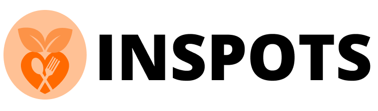
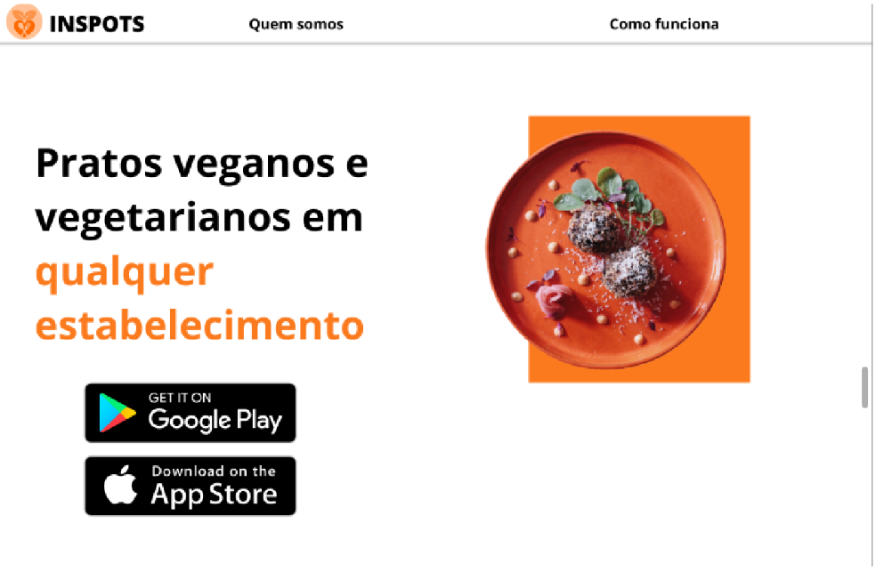
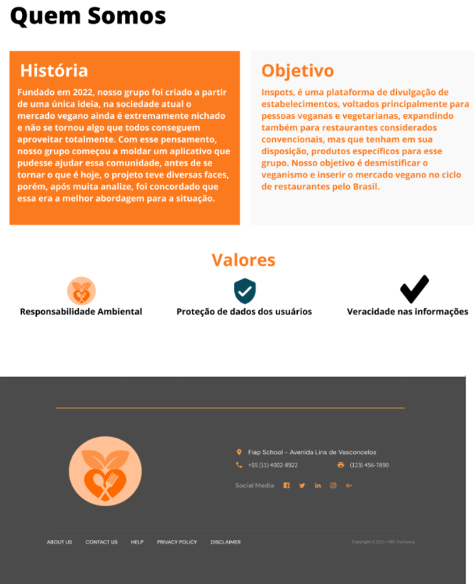
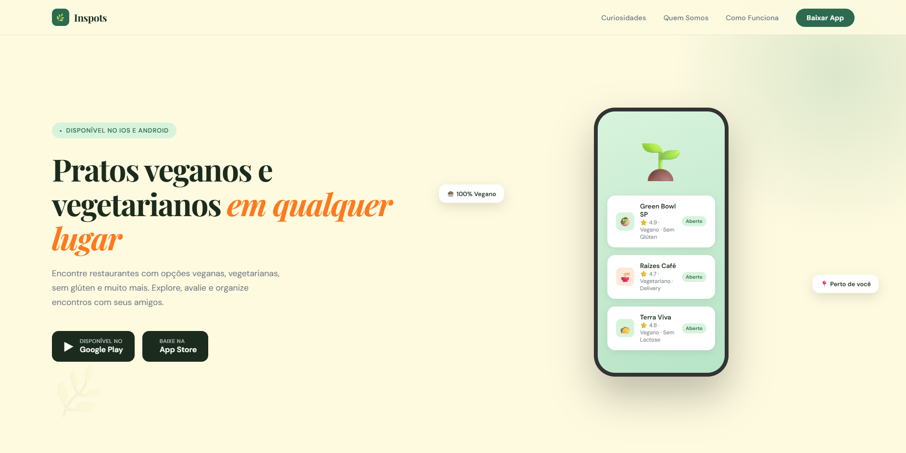
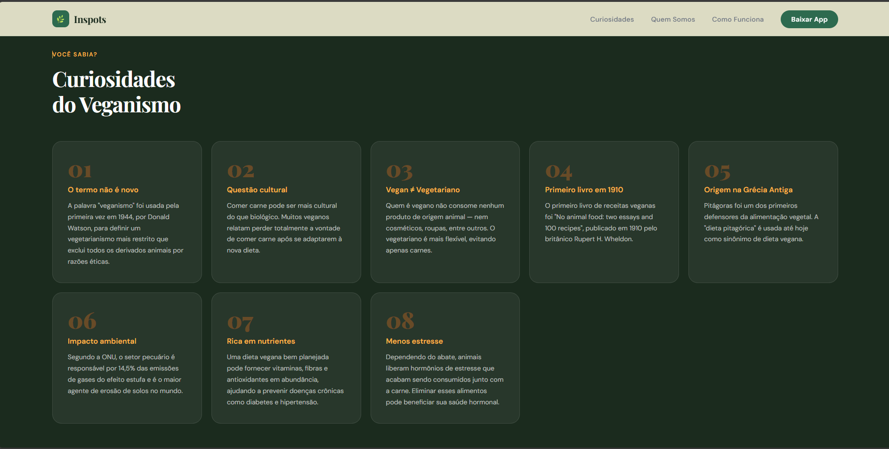
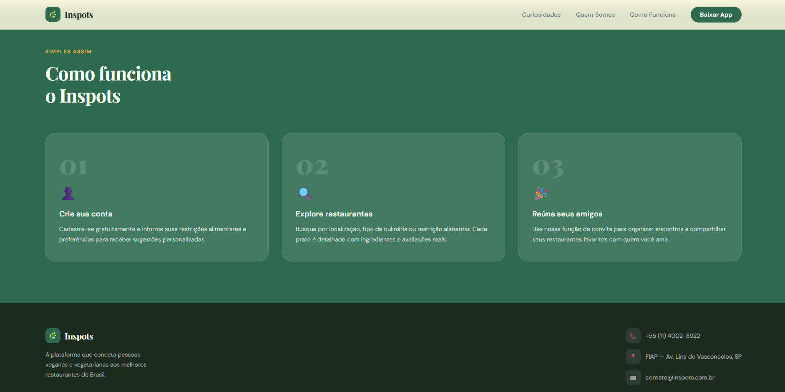

<div align="center">
  

  # Inspots — Landing Page Redesign

  **App de busca de restaurantes veganos, vegetarianos e com opções para restrições alimentares.**

  
  
  

</div>

---

## 📋 Sobre o Projeto

O **Inspots** é uma plataforma que conecta pessoas veganas e vegetarianas aos melhores restaurantes do Brasil, incluindo estabelecimentos convencionais que ofereçam opções para celíacos, intolerantes à lactose, e outros grupos.

Este repositório contém a **landing page** do projeto, que passou por um redesign completo com foco em modernidade, responsividade e identidade visual alinhada à proposta vegana/saudável.

---

## ✨ O Redesign

### Antes

| Hero | Quem Somos |
|------|------------|
|  |  |

### Depois

| Hero | Curiosidades | Como Funciona |
|------|-------------|---------------|
|  |  |  |

---

## 🚀 Melhorias Implementadas

### Visual
- Nova paleta de cores com tons verdes/creme alinhada à identidade vegana
- Tipografia moderna com **Playfair Display** (títulos) + **DM Sans** (corpo)
- Mockup animado de celular mostrando o app em uso no hero
- Cards de curiosidades em grid responsivo, substituindo o carrossel original
- Seção "Como Funciona" com 3 steps visuais e claros
- Footer reorganizado com ícones e informações bem estruturadas

### Técnico
- CSS totalmente reescrito com **CSS Variables** para fácil manutenção
- Layout **100% responsivo** com media queries (mobile, tablet e desktop)
- Eliminação de posicionamentos absolutos que quebravam em telas menores
- Animações CSS suaves (fade-up, float, pulse, slide-down)
- Código separado em `index.html` e `styles.css`
- Comentários em inglês em todo o código

---

## 📁 Estrutura do Projeto

```
inspots/
├── index.html          # Estrutura da página
├── styles.css          # Estilos e animações
├── img/
├── After/              # Screenshots do redesign
│   ├── image1.png
│   ├── image2.png
│   └── image3.png
└── Before/             # Screenshots originais
    ├── image1.png
    └── image3.png
```

---

## 🎨 Paleta de Cores

| Token | Cor | Hex |
|-------|-----|-----|
| `--green` | Verde principal | `#2D6A4F` |
| `--green-light` | Verde claro | `#40916C` |
| `--green-pale` | Verde suave | `#D8F3DC` |
| `--orange` | Laranja destaque | `#FC7A1E` |
| `--cream` | Creme fundo | `#FEFAE0` |
| `--dark` | Escuro | `#1B2B1E` |

---

## 📱 Seções da Página

- **Nav** — Barra de navegação fixa com blur backdrop e botão CTA
- **Hero** — Headline principal, descrição, botões de download e mockup do app
- **Stats** — Números de impacto (restaurantes, avaliações, usuários)
- **Curiosidades** — 8 cards informativos sobre veganismo
- **Quem Somos** — História e missão do projeto com quote em destaque
- **Como Funciona** — 3 passos para começar a usar o app
- **Footer** — Informações de contato e copyright

---

## 👥 Equipe

Desenvolvido na **FIAP** — Avenida Lins de Vasconcelos, São Paulo.

---

<div align="center">
  Feito com 🌱 para a comunidade vegana • © 2022 Inspots
</div>
